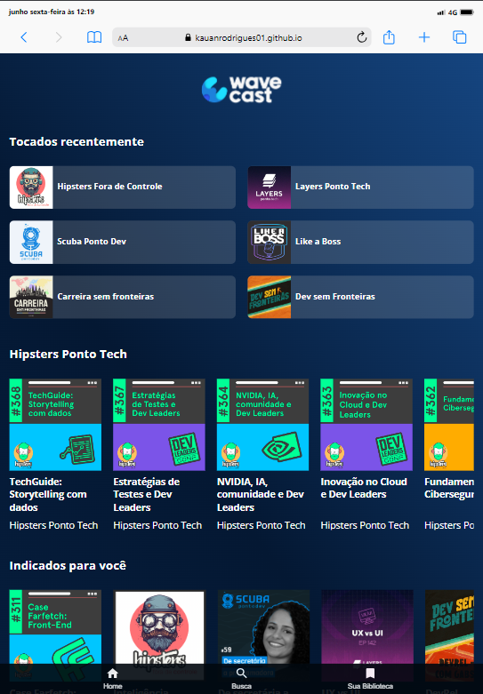

# Grid: Construindo Layouts Responsivos

Este repositório contém exemplos e explicações sobre como usar Grid Layout CSS para construir layouts responsivos na web. Através de demonstrações práticas, você aprenderá a aproveitar ao máximo esta poderosa ferramenta de CSS para criar layouts flexíveis e adaptáveis a diferentes dispositivos.

---

## 🌐 Visão Geral

O projeto foca em ensinar como utilizar o Grid Layout para criar layouts que se ajustam automaticamente a dispositivos de diferentes tamanhos, proporcionando uma experiência consistente e eficaz aos usuários.

---

## 🖥️ Imagens do Projeto

### Desktop

### Tablet

### Mobile

---

## 🛠️ Tecnologias Utilizadas

- **HTML5:** Estrutura básica do site.
- **CSS3 com Grid Layout:** Estilização e criação de layouts responsivos.
- **JavaScript:** Funcionalidades interativas (se aplicável).
